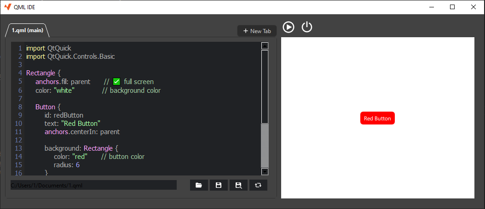

# QML Previewer

**QML Previewer** is a lightweight and easy-to-use Qt application for live editing and previewing QML code.
 With this tool, you can instantly see the rendered result of your QML interface on the right side of the screen as you make changes in the editor on the left.

---

## Features

- **Live Preview:** Instantly see changes to your QML code without needing to restart the application.
- **QML Editor:** A simple editor that allows you to write and test your QML code.
- **Qt Quick support:** Supports all basic features of Qt Quick, including items, layouts, etc.

---

## Screenshots

Below is an simple example of the **QML Previewer** in action:

